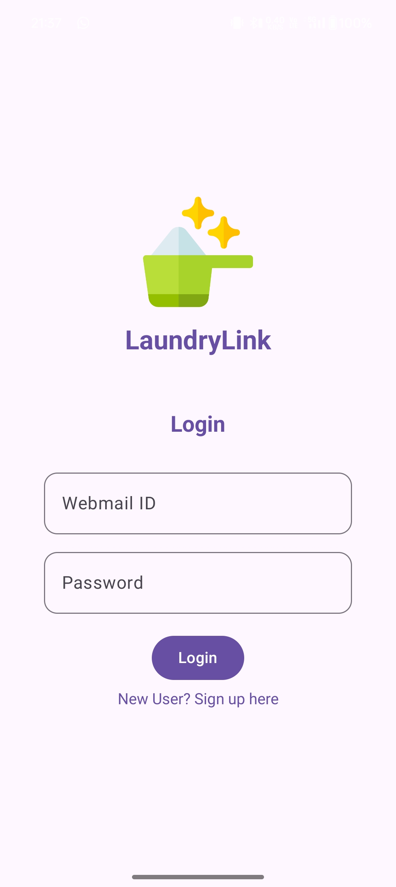
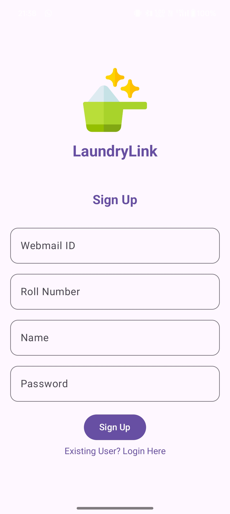
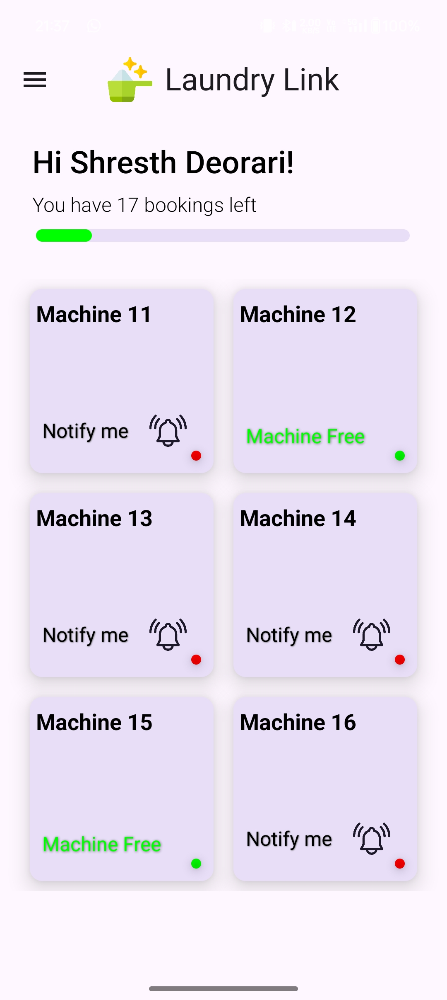
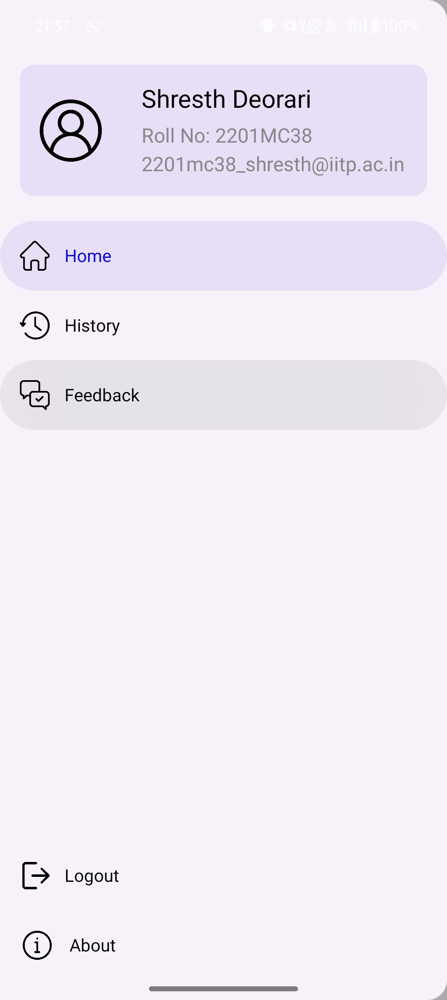
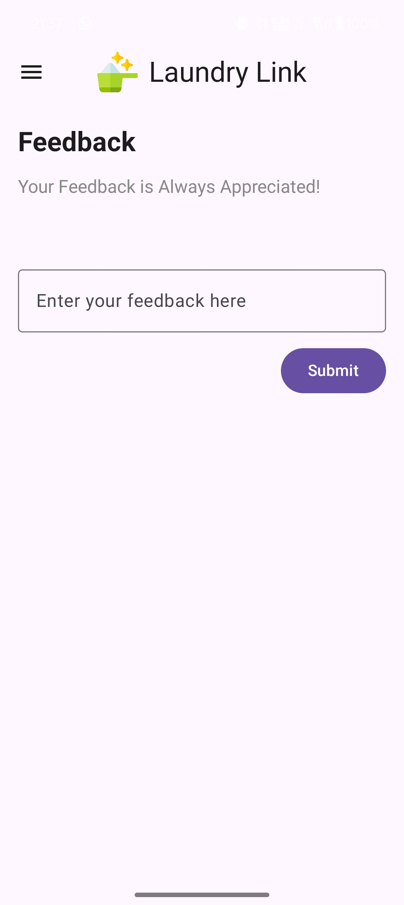
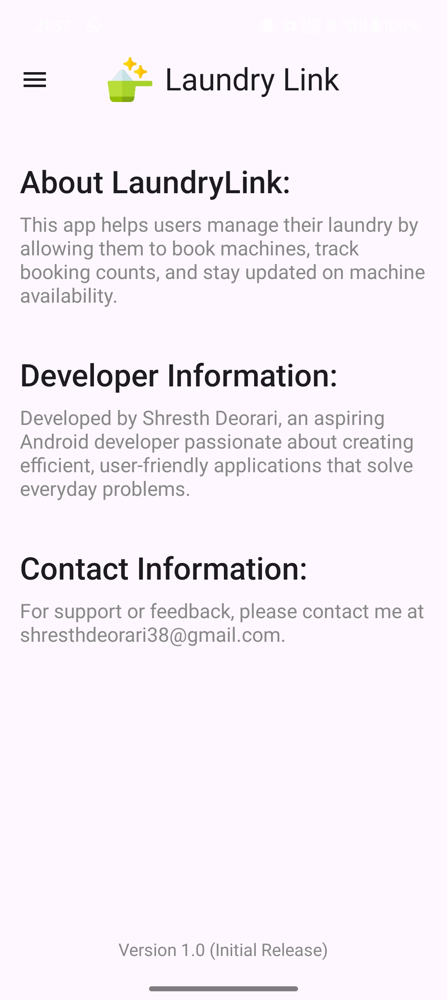

# LaundryLink

## Overview
LaundryLink is a robust mobile application developed to digitalize the washing machine booking procedure at our college. It facilitates efficient management of bookings for students while providing the management with a secure way to monitor and log activities.

## ScreenShots

1) Login and Sign Up Screens  
   <div style="display: flex; justify-content: space-between;">
       
       
   </div>

2) Home Screen and Sidebar  
   <div style="display: flex; justify-content: space-between;">
       
       
   </div>

3) Feedback and About  
   <div style="display: flex; justify-content: space-between;">
       
       
   </div>


## Features
- **Real-time Booking Management**: Updates machine status on Firebase and reflects availability changes immediately across all clients.
- **Data Integrity & Reset Functionality**: Allows for a "clear all bookings" function that resets machine statuses to free.
- **Automated Status Update**: Automatically releases machines after the expiration timestamp for continuous access.
- **Firestore Live Updates**: Uses Firestore listeners for automatic UI updates on data changes.
- **Detailed User Tracking**: Tracks and displays user bookings with timestamps for monitoring purposes.
  
## UI Details
- **Modern UI with Jetpack Compose**: Designed using Jetpack Compose for modular and responsive UI components.
- **Dynamic Status Cards**: Each machine is displayed as a card with real-time availability and booking status.
- **Interactive Buttons**: Features for booking, releasing machines, and an admin-only "Clear All Bookings" button.
- **Live Data Synchronization**: Uses LiveData for real-time Firestore data management.

## Tech Stack
- **Language**: Kotlin
- **UI Framework**: Jetpack Compose
- **Backend**: Firebase Firestore
- **Other Libraries**: LiveData, Firebase Authentication (if implemented), Material3

## Installation
To set up the LaundryLink project locally, follow these steps:

1. **Clone the repository**:
   ```sh
   git clone https://github.com/Shresth-Deorari/LaundryLink.git
   ```

2. **Open the project in Android Studio**.

3. **Add the necessary dependencies** in your `build.gradle` files:
   ```sh
   implementation 'com.google.firebase:firebase-firestore-ktx:24.1.2'
   implementation 'androidx.lifecycle:lifecycle-livedata-ktx:2.5.0'
   implementation 'androidx.compose.material3:material3:1.0.0'

   ```

4. **Sync the project** with Gradle files.

5. **Run the application** on an emulator or physical device.

## Usage
- To book a washing machine, open the app and select an available machine card.
- Use the admin functionality to clear all bookings when necessary.

## Development Process

- **Wireframing:** The initial UI was designed using Figma to create a blueprint for the app.
- **Navigation Drawer:** Faced challenges in creating a visually appealing navigation drawer, which was implemented using NavController and Material3 Scaffold.
- **Database Management:** Integrated a Room database to store booking history details for users.
- **Shared Preferences:** Utilized SharedPreferences for managing smaller data, including state changes and login information.
- **Firebase Authentication:** Invested significant effort in implementing Firebase login and signup features to ensure secure user authentication.
- **Responsive UI:** Focused on adding responsive UI elements and keyboard listeners for an enhanced user experience, along with defensive programming practices.
- **Programming Paradigm:** The app was developed using Object-Oriented Programming principles.

## Challenges Overcome
- Developed a seamless real-time data handling system that ensures instant UI updates, enhancing user interaction.
- Optimized Firestore calls to minimize latency, significantly improving app performance and responsiveness.
- Successfully implemented Firebase authentication, tackling various security and user management challenges.
- Created an efficient Room database for storing user booking history, enabling quick access to previous records.
- Addressed UI responsiveness and keyboard listener issues to enhance the overall user experience.

## Contributions

Contributions are welcome! If you'd like to contribute to this project, please follow these steps:

1. Fork the repository.
2. Create a new branch for your feature or bug fix.
3. Make your changes and commit them.
4. Push your branch and create a pull request.

## Thank You!

Thank you for taking the time to explore the LaundryLink project! Your interest and support are greatly appreciated. If you have any questions or feedback, feel free to reach out.

